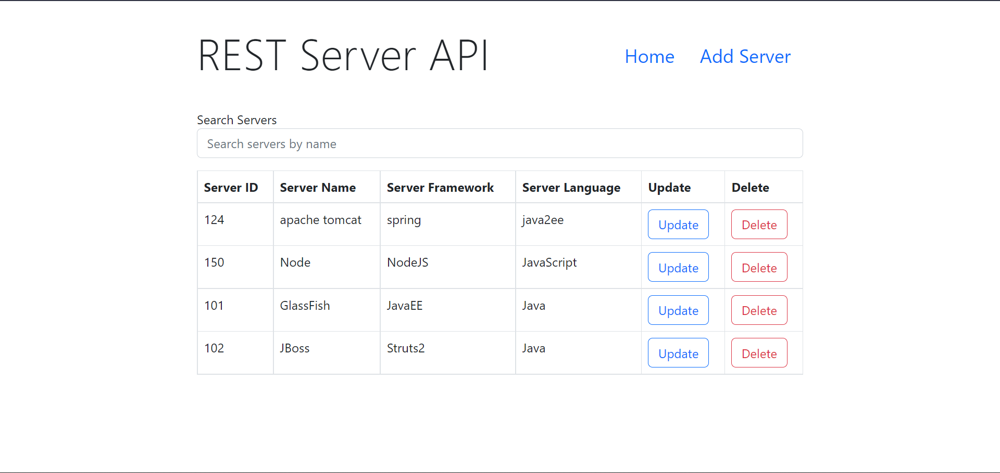
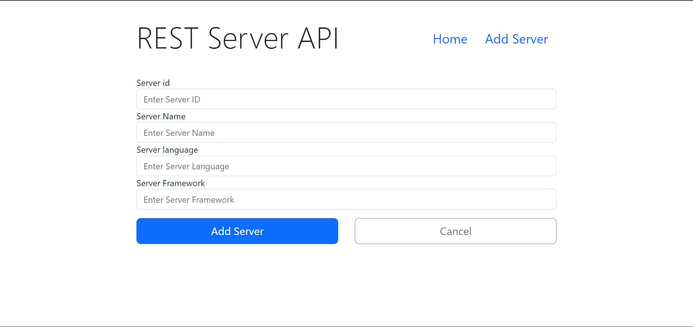
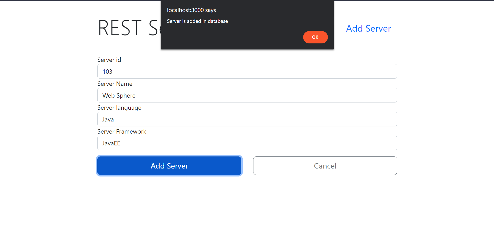
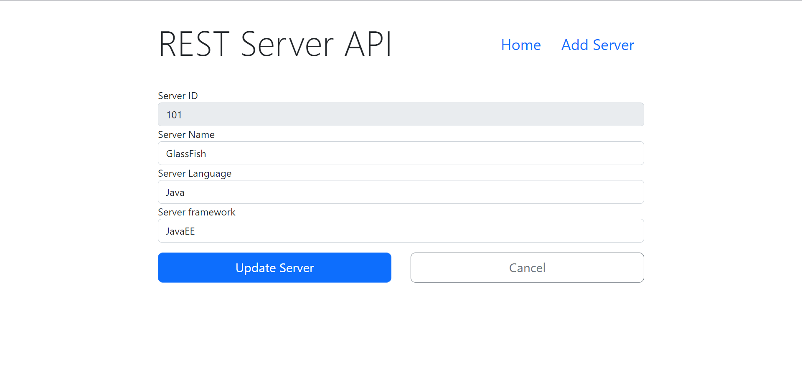
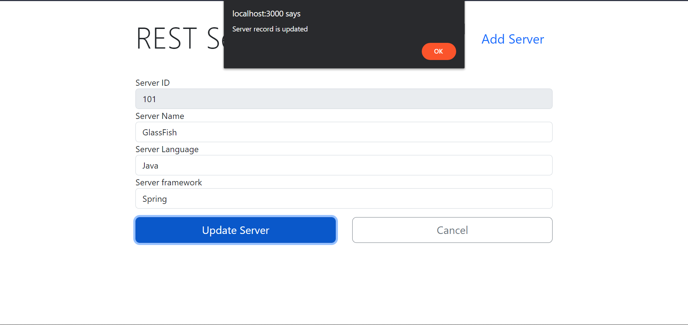
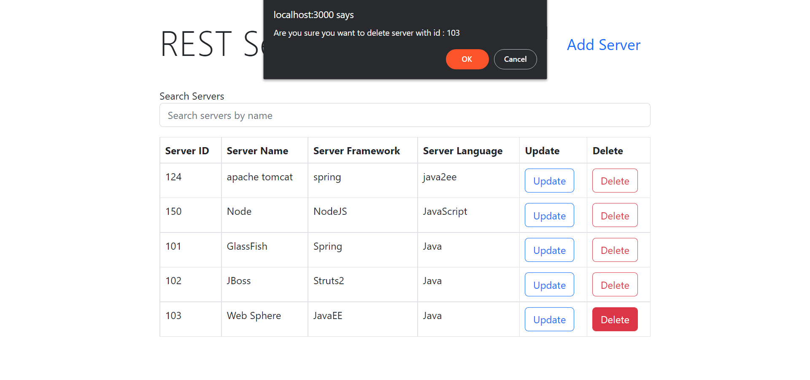
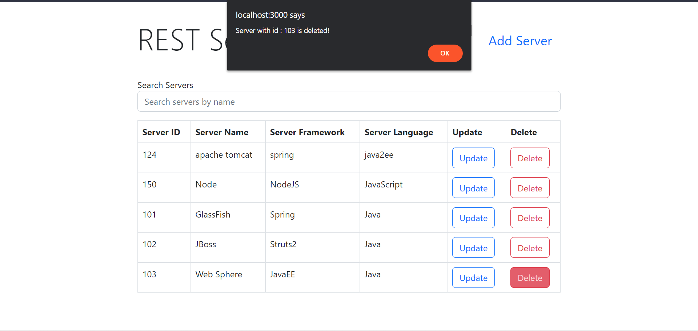

# Microservice-Project-Task4

Project Work for Microservice - AXYYA Digital.

## Task 4 Web UI Forms.
- [x] Create a basic Web UI front-end for an application that you created in Task 1 or 2 using any UI framework of your choice. You should be able to:
  - [x] Show Records.  
    
  - [x] Create Records.   
    
    
  - [x] Update Record.   
    
    
  - [X] Delete records. 
    
    
  - [x] Find records by name.
    
